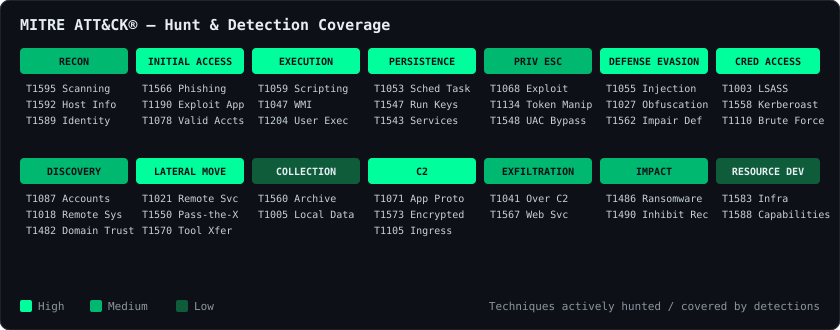

<!-- ⚠️ Search this file for "TODO" and replace the placeholders with your real details before publishing. -->

<div align="center">


<a href="https://git.io/typing-svg"></a>

<p>
<!-- TODO: replace with your portfolio URL once hosted -->
<a href="https://v3nomtech.github.io"></a>
<!-- TODO: replace YOUR-LINKEDIN with your LinkedIn handle -->
<a href="https://www.linkedin.com/in/venomtech/"></a>
<!-- TODO: replace with your contact email -->
<a href="mailto:venomtechofficial@gmail.com"></a>
<a href="https://x.com/venom_tech_"></a>
<a href="https://medium.com/@venomtechofficial"></a>
</p>
<p>
<a href="https://app.hackthebox.com/users/588340"></a>
<a href="https://tryhackme.com/p/CYbErXV3nOm"></a>
<a href="https://instagram.com/venom.tech.official"></a>
<a href="https://youtube.com/@venomelectronics"></a>
</p>


<br/><br/>



</div>

---

## `$ cat about.txt`

```yaml
name        : V3nom
role        : [Threat Hunter, Threat Intelligence Analyst, Reverse Engineer, Security Researcher]
background  : SOC operations — alert triage, incident response, detection engineering
focus       :
  - Hypothesis-driven threat hunting across endpoint, network & identity telemetry
  - Tracking threat actors, C2 infrastructure & IOCs → turning intel into detections
  - Malware analysis & reverse engineering (static + dynamic)
  - Offensive security, AD attacks & bug bounty
motto       : "Think like the adversary. Hunt like the defender."
```

- 🔎 **Threat Hunting** — KQL / SPL hunts mapped to **MITRE ATT&CK**, detection engineering with Sigma & YARA
- 🧠 **Threat Intelligence** — CVE / KEV / EPSS triage, IOC enrichment, C2 tracking, actor TTP profiling
- 🧬 **Reverse Engineering** — unpacking, deobfuscation and dissecting malware samples in Ghidra / IDA / x64dbg
- 🛡️ **SOC** — hands-on Blue Team experience with SIEM, EDR and incident response workflows
- 🏆 **CTFs & Bug Bounty** — multiple CTF wins, **Hall of Fame** listings and valid bounties across programs

### ⚡ `$ cat /proc/v3nom/status`

<!-- TODO: keep these current -->
| | |
|---|---|
| 🧬 **Currently reversing** | `GentleMan Ransomware` |
| 🔎 **Currently hunting** | `LOLBin abuse / Kerberoasting` |
| 📚 **Currently studying** | `CRTO` |
| 🤝 **Open to** | Threat hunting / CTI / DFIR roles, malware research, CTF team-ups |

---

## `$ ls ./certifications`

<div align="center">

| Certification | Issuer | Domain |
|:---:|:---:|:---:|
| **CPTS** — Certified Penetration Testing Specialist | Hack The Box | Offensive / AD |
| **CJCA** — Certified Junior Cybersecurity Associate | Hack The Box | Offensive + Defensive |
| **SC-200** — Security Operations Analyst Associate | Microsoft | SOC / Sentinel / Defender |
| **eJPT** — eLearnSecurity Junior Penetration Tester | INE | Penetration Testing |

<br/>


</div>

### 🧪 Hack The Box Pro Labs

<div align="center">

| Pro Lab | Focus | Status |
|:---:|:---|:---:|
| **Dante** | Network pivoting, Linux & Windows exploitation, enterprise lateral movement | ✅ Completed |
| **RastaLabs** | Red-team ops, Active Directory, phishing, AV evasion, persistence | ✅ Completed |


</div>

### 🗺️ Certification Roadmap

<!-- TODO: adjust to the certs you're actually targeting -->
```text
[██████████] 100%  CPTS · CJCA · SC-200 · eJPT      ✔ done
[██████░░░░]  60%  HTB CDSA  (defensive / SOC)      ⏳ in progress
[███░░░░░░░]  30%  CRTO      (red team ops)         ⏳ in progress
[█░░░░░░░░░]  10%  GREM      (reverse engineering)  🎯 planned
[░░░░░░░░░░]   0%  OSCP                             🎯 planned
```

---

## `$ ./achievements --list`

```diff
+ 🏆 Winner / podium finishes in multiple CTF competitions
+ 🎖️ Multiple Hall of Fame acknowledgements for responsibly disclosed vulnerabilities
+ 💰 Rewarded bug bounties across public & private programs
+ 🧪 HTB Pro Labs: Dante & RastaLabs completed
+ 🎓 CPTS · CJCA · SC-200 · eJPT certified
```

<details open>
<summary><b>🎖️ Hall of Fame & Bug Bounties</b></summary>
<br/>

<!-- TODO: replace with your real programs (link to the HoF page where possible) -->
| Program | Recognition | Vulnerability Class | Year |
|---|---|---|:---:|
| [`Kommunicate`](https://www.kommunicate.io/hall-of-fame) | Hall of Fame | `IDOR>` | 2023 |
| [`BOSCH`](https://psirt.bosch.com/hall-of-fame/websites-hall-of-fame.html) | Hall of Fame | `RCE` | 2025 |
| `Marasoft` | 💰 Bounty | `PII` | 2025 |

</details>

---

## `$ ./hunt --coverage mitre`

<div align="center">

</div>

---

## `$ ls ./research`

<!-- TODO: create these repos (or change the links to your existing ones) -->
| | Repository | What's inside |
|:---:|---|---|
| 🎯 | **[detection-rules](https://github.com/v3nomtech/detection-rules)** | Sigma, YARA, KQL & SPL hunt queries — each mapped to MITRE ATT&CK with test data |
| 🧬 | **[malware-analysis](https://github.com/v3nomtech/malware-analysis)** | Reverse-engineering reports: unpacking, config extraction, IOCs & YARA per family |
| 🚩 | **[ctf-writeups](https://github.com/v3nomtech/ctf-writeups)** | Write-ups from competitions I've played & won — web, pwn, rev, forensics |
| 🧠 | **[threat-intel-reports](https://github.com/v3nomtech/threat-intel-reports)** | Actor profiles, campaign tracking and C2 infrastructure analysis |

### 📝 Latest Write-ups

<!-- Auto-updated by .github/workflows/blog-posts.yml -->
<!-- BLOG-POST-LIST:START -->
- 📝 [The Same Adversary Has Nine Names](https://medium.com/@venomtechofficial/the-same-adversary-has-nine-names-f609f6a2cfce?source=rss-f6f7f8fcfbab------2) <sub>· Aug 23, 2026</sub>
- 📝 [One Mailbox. One Terabyte. One Hard Lesson for Banking.](https://medium.com/@venomtechofficial/one-mailbox-one-terabyte-one-hard-lesson-for-banking-c105f848d47f?source=rss-f6f7f8fcfbab------2) <sub>· Jul 28, 2026</sub>
- 📝 [Inside The Gentlemen Ransomware: Reverse Engineering &amp; Static Analysis](https://medium.com/@venomtechofficial/inside-the-gentlemen-ransomware-reverse-engineering-static-analysis-c1b5585fa93b?source=rss-f6f7f8fcfbab------2) <sub>· Jul 19, 2026</sub>
- 📝 [Pester.bat: The PowerShell Test Runner That Attackers Turned Into a Weapon](https://medium.com/@venomtechofficial/pester-bat-the-powershell-test-runner-that-attackers-turned-into-a-weapon-c88332072fc0?source=rss-f6f7f8fcfbab------2) <sub>· Jun 30, 2026</sub>
- 📝 [OpenCTI: A Complete Beginner’s Guide to Free, Open-Source Threat Intelligence](https://medium.com/@venomtechofficial/opencti-a-complete-beginners-guide-to-free-open-source-threat-intelligence-80e7d1eefc30?source=rss-f6f7f8fcfbab------2) <sub>· Jun 12, 2026</sub><!-- BLOG-POST-LIST:END -->

---

## `$ ./projects --featured`

<div align="center">

<a href="https://github.com/v3nomtech/V3nom-Intel">
    
  </a>
  <a href="https://github.com/v3nomtech/v3nomEyE">
    
  </a>


</div>

| Project | Description |
|---|---|
| 🛰️ **[V3nom-Intel](https://github.com/v3nomtech/V3nom-Intel)** | Open-source threat intelligence console — live CVEs (NVD), CISA KEV, EPSS scores, abuse.ch IOCs, active C2 servers on a global map, breaches and infosec news in one dashboard. |
| 👁️ **[v3nomEyE](https://github.com/v3nomtech/v3nomEyE)** | Automated bug bounty framework — a 17-phase recon pipeline covering XSS, SQLi, SSRF, IDOR, JWT, cloud misconfig, JS secrets and more. |

---

## `$ curl -s cisa.gov/kev | head -5`

> 🚨 Latest vulnerabilities added to the **CISA Known Exploited Vulnerabilities** catalog — refreshed daily by a GitHub Action.

<!-- KEV-START -->
| CVE | Vendor / Product | Vulnerability | Added | Ransomware |
|---|---|---|---|:---:|
| [CVE-2026-86950](https://nvd.nist.gov/vuln/detail/CVE-2026-86950) | Apple Multiple Products | Apple Multiple Products Out-of-Bounds Write Vulnerability | 2026-09-29 | — |
| [CVE-2026-88772](https://nvd.nist.gov/vuln/detail/CVE-2026-88772) | Citrix NetScaler | Citrix NetScaler Improper Restriction of Operations within the Bounds of a Memory Buffer Vulnerability | 2026-09-27 | — |
| [CVE-2026-88771](https://nvd.nist.gov/vuln/detail/CVE-2026-88771) | Citrix NetScaler | Citrix NetScaler Improper Input Validation Vulnerability | 2026-09-27 | — |
| [CVE-2026-87902](https://nvd.nist.gov/vuln/detail/CVE-2026-87902) | WordPress Core | WordPress Core Remote File Inclusion Vulnerability | 2026-09-25 | — |
| [CVE-2026-67279](https://nvd.nist.gov/vuln/detail/CVE-2026-67279) | MikroTik RouterOS | Mikrotik RouterOS Improper Enforcement of Behavioral Workflow Vulnerability | 2026-09-25 | — |
<!-- KEV-END -->

---

## `$ ls ./arsenal`

<details>
<summary><b>🔵 Blue Team / Threat Hunting / DFIR</b></summary>
<br/>
<p>


</p>
</details>

<details>
<summary><b>🧠 Threat Intelligence</b></summary>
<br/>
<p>


</p>
</details>

<details>
<summary><b>🧬 Reverse Engineering / Malware Analysis</b></summary>
<br/>
<p>


</p>
</details>

<details>
<summary><b>🔴 Offensive Security</b></summary>
<br/>
<p>


</p>
</details>

<details>
<summary><b>💻 Languages</b></summary>
<br/>
<p>


</p>
</details>

---

## `$ nmap -sV ctf_platforms`

<div align="center">

<a href="https://app.hackthebox.com/users/588340"></a>
<br/><br/>
<a href="https://tryhackme.com/p/CYbErXV3nOm"></a>

</div>

---

## `$ gh stats --user v3nomtech`

<div align="center">


  

  

  

<!-- Generated by .github/workflows/snake.yml into the `output` branch -->
<picture>
  <source media="(prefers-color-scheme: dark)" srcset="https://raw.githubusercontent.com/v3nomtech/v3nomtech/output/github-snake-dark.svg" />
  <source media="(prefers-color-scheme: light)" srcset="https://raw.githubusercontent.com/v3nomtech/v3nomtech/output/github-snake.svg" />
  
</picture>

</div>

---

<div align="center">

```
┌──(v3nom㉿kali)-[~]
└─$ echo "Open to threat hunting, CTI, malware research & collab on CTFs — DMs are open."
```


</div>
